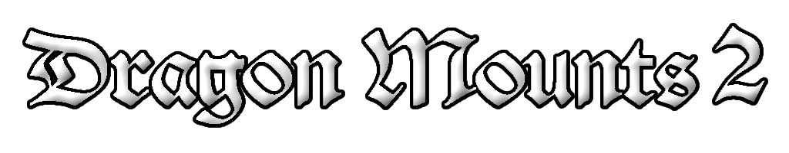

Dragon Mounts 2 is the official second add-on in the series that adds fire breathing dragons, nests structures, new tools and armor!

It is a different add-on compared to it's prequel Dragon Mounts. The premise of this version is to expand the original Dragon Mounts by adding in an rpg adventure-styled experience.

> Disclaimer: You have to play the Dragon Mounts add-ons by themselves, not together!

## License
The add-ons binaries, as well as its textures and code are licensed under the GPLv3 license.

- You CAN modify, copy and distribute this add-on.
- You CAN use it privately or for commercial use.
- You CAN'T change the license of your modified version.
- You CAN'T make the modified source code closed.
- You HAVE TO indicate any changes in the modified version.

## Credits
- Tomanex - Project Owner & Lead Artist
- JDSKoala - Project Co-owner, Modeler and Animator
- Moaswies - Coder
- Mr. Goofy (Mrngda) - Former Coder
- Equinox - Artist
